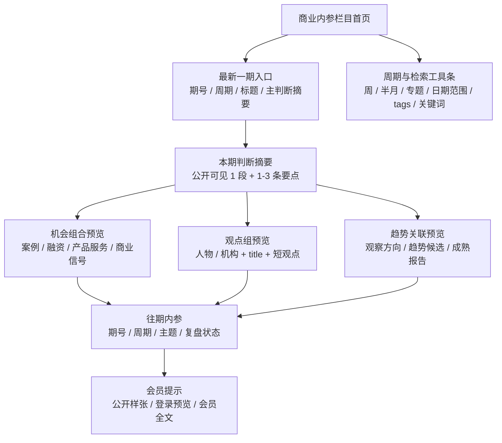
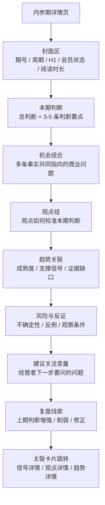
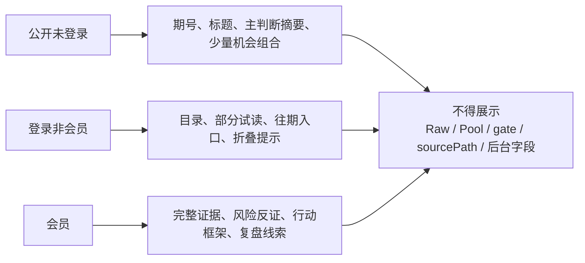

# WSD-20260522 商业内参页面规划与重设计规格 Closeout

## 0. 执行结论

本任务属于 `页面 / 文案 / Typography Harness`，只产出商业内参栏目规划与页面重设计规格，不改代码、不改数据、不生成页面、不进入 Build & Release。

结论：

- 商业内参应采用 `决策简报式内参` 为主方案，吸收期刊式内参的期号和归档能力，以及机会组合看板的组合阅读能力。
- 商业内参不是订阅营销页、普通文章列表、趋势报告归档、公开热力榜或后台 dashboard。它应是一份按周期组织的商业决策文件。
- 核心阅读路径为：`本期判断 -> 机会组合 -> 观点组 -> 趋势关联 -> 风险反证 -> 行动建议 -> 复盘线索`。
- 栏目首页首先呈现最新一期、期号筛选和往期索引，不设置营销型 hero，不使用旧版 `brief.html` 作为布局底稿。
- 内参详情页必须区分公开样张、登录预览和会员完整内容；但具体价格、会员权益和权限策略仍需用户确认。
- 阶段 2B 可以在用户确认本规格后启动信息架构整合与页面实现。涉及价格权益、真实权限、完整热力图公开边界的部分，需在 Build 前确认。

验收建议：`accepted_with_notes`。核心规格完整，需用户确认项不阻塞页面 IA 与静态状态实现，但阻塞真实会员权益和付费权限落地。

## 0.1 页面结构示意图

### 商业内参栏目首页

### 内参期详情页

### 内容分层示意

## 1. 最小读取清单与实际读取清单

### 1.1 派发单要求读取

| 文件 | 状态 | 用途 |
|---|---|---|
| `AGENTS.md` | 已读取用户提供内容 | 任务入口、页面 / 文案 / Typography 路由、硬停顿规则 |
| `context/00-current-state.md` | 已读取 | V2.1 当前状态、桌面优先、页面任务 Typography-first / Copy-first |
| `context/01-product-map.md` | 已读取 | 四个一级栏目边界、商业内参定位 |
| `context/02-vi-style.md` | 已读取 | 暖白、深澜蓝、香槟金、字体和页面气质 |
| `context/03-copy-style.md` | 已读取 | 文案克制、清楚、有商业判断，不暴露内部语言 |
| `context/06-execution-harness.md` | 已读取 | 页面 / 文案 / Typography Harness |
| `agent-workflow/product/DESIGN.md` | 已读取 | V2 设计总纲、商业内参母版、前台 / Admin 边界 |
| `docs/brand/wavesight-ai-vi/page-typography-position-guidelines.md` | 已读取 | 栏目页、详情页、卡片、侧栏字体位置规范 |
| `agent-workflow/execution/WSD-20260522-business-brief-page-redesign-spec.md` | 已读取 | 本派发单 |

### 1.2 额外读取

| 文件 / 能力 | 原因 |
|---|---|
| `docs/brand/wavesight-ai-vi/brand-tokens.css` | `context/02-vi-style.md` 明确页面视觉任务默认读取 token；用于 Typography 表和视觉约束 |
| `skills/guanlan-copy-style/SKILL.md` | `context/03-copy-style.md` 指定全站基础文案以该 Skill 为准；用于 Copy-first 文案表 |
| `design-taste-frontend` | 派发单要求查看可调用设计规范；仅用于抗模板化和阅读节奏，不覆盖观澜 VI |
| `01-SiteV2/site/data/site-content.json` | 用于确认当前 `brief`、信号、观点、趋势、tags 的实际字段，不作为旧版面依据 |

未读取旧 `brief.html` 和 `app.js`。原因：本任务不做代码实现，当前字段可从 `site-content.json` 直接确认；旧页面明确不得作为改造底稿。

## 2. 已吸收 closeout 清单

| 指定 closeout | 状态 | 吸收结论 |
|---|---|---|
| `agent-workflow/reports/WSD-20260522-site-page-module-layer1-diagnostic-closeout.md` | 未发现 | 未发现，不阻塞本规格任务；不得继承不存在结论 |
| `agent-workflow/reports/WSD-20260522-business-signals-page-redesign-spec-closeout.md` | 已读取 | 商业信号是事实台账 + 档案详情；只展示事实、来源、分类和关联，不展示指导式字段 |
| `agent-workflow/reports/WSD-20260522-daily-observation-page-redesign-spec-closeout.md` | 已读取 | 今日观察是按日期组织的每日长文首页；商业信号统一跳信号详情，观点跳观点详情但不新增一级导航 |
| `agent-workflow/reports/WSD-20260522-trend-tracking-page-redesign-spec-closeout.md` | 已读取 | 趋势追踪负责跨时间证据累积、观察方向、趋势候选和成熟报告，不把弱信号包装成趋势 |
| `agent-workflow/reports/WSD-20260522-opinion-rating-governance-closeout.md` | 未发现 | 未发现，不阻塞本规格任务；以 follow-builders closeout 和当前数据字段为准 |
| `agent-workflow/reports/WSD-20260522-opinion-rating-followbuilders-closeout.md` | 已读取 | 2026-05-22 前台观点为 1 个 feature、11 个 sidebar；archive / discard 不得前台露出 |
| `agent-workflow/reports/WSD-20260522-daily-observation-skill-consistency-closeout.md` | 已读取 | 今日观察 writer / QC 不负责首页或栏目短文案；页面摘要归本页面 / 文案流程处理 |

## 3. 当前数据解析结论

已检查 `01-SiteV2/site/data/site-content.json`：

| 数据对象 | 当前字段 / 数量 | 对商业内参的意义 |
|---|---|---|
| `brief` | `issue / period / title / summary / heat / evidence / member / link` | 当前只有单期预览结构，可支撑内参样张和一期详情雏形 |
| `brief.issue` | `Preview.001` | 可映射为内参期号，但正式期号规则待确认 |
| `brief.period` | `2026.05.22` | 当前是日期点，不是周 / 半月 / 专题周期 |
| `brief.summary` | 1 条 | 可作为公开样张摘要，不足以支撑完整内参详情 |
| `brief.heat` | 0 条 | 当前不能展示完整热力图，只能规划热力摘要空状态 |
| `brief.evidence.points` | 3 条 | 当前内参样张已有观点参照，但不能替代事实证据 |
| `brief.evidence.risks` | 0 条 | 风险与反证结构需要补齐 |
| `brief.evidence.trends` | 0 条 | 趋势关联需要从 trends / trendReports 或后续关系字段补齐 |
| `brief.member` | `publicSample / loginPreview / fullNote` | 已有公开 / 登录 / 会员三层文案雏形 |
| `contentIndex.signals` | 21 条 | 可作为机会组合、案例 / 融资 / 产品服务卡来源 |
| `contentIndex.points` | 35 条 | 可作为观点组来源，必须先经过前台评级过滤 |
| `contentIndex.trends` | 4 条 | 只能作为观察方向 / 趋势候选引用，不得包装成熟趋势 |
| `contentIndex.trendReports` | 1 条 | 当前更接近继续观察样本，成熟报告区需有空状态 |
| `contentIndex.cases` | 0 条 | 独立案例库为空，案例卡需先从商业信号映射 |
| `tagTaxonomy` | 61 个 tag，9 个 group | 可支撑 tags 检索、期号归类和弱关系聚合 |

关键风险：

- 当前 `brief` 只有单期预览，不足以支撑真正的周 / 半月 / 专题期列表。
- 当前 `heat`、`risks`、`trends` 为空，不能在前台假装已有完整热力图、风险矩阵或趋势关联。
- 当前关系字段整体偏弱，第一版页面应采用“显式关系优先，tags / date / period 弱关联兜底”的策略。

## 4. 商业内参与其他栏目的边界表

| 内容 / 用户任务 | 今日观察 | 商业信号 | 趋势追踪 | 商业内参 |
|---|---|---|---|---|
| 当天最值得读的一件事 | 主展示对象，形成每日长文 | 可作为当天事实素材 | 只作趋势背景 | 可作为本期复盘或证据引用 |
| 单条公司动作 / 融资 / 产品发布 | 只有进入当天叙事时引用 | 主展示对象，事实档案 | 作为支撑信号 | 作为机会组合素材 |
| 多条同类信号 | 可作为当天背景 | 按事实台账展示 | 判断是否形成趋势候选 | 组合成“机会组合”或“本期判断”的证据 |
| 已评级观点卡 | 观点校准，不作事实主证据 | 事实详情的观点参照 | 趋势观察的观点参照 | 观点组，用来修正或支撑本期判断 |
| 观察方向 / 趋势候选 | 只可弱提示 | 不展示为信号结论 | 主展示对象 | 引用为趋势关联，说明成熟度和缺口 |
| 成熟趋势报告 | 只作关联入口 | 只作关联入口 | 主展示对象 | 可成为本期判断的核心证据 |
| 机会判断 | 不输出行动方案 | 不作为字段直出 | 报告段落 | 核心内容之一，但必须保留反证和边界 |
| 风险 / 反证 | 今日文章中的边界 | 事实详情中的缺口 | 趋势报告中的限制 | 必须作为内参详情核心模块 |
| 复盘线索 | 日期连续阅读 | 单条信号后续关联 | 趋势增强 / 减弱 | 本期与上期判断的增强、削弱或修正 |
| 会员内容 | 不承担 | 不承担 | 可关联 | 主承载层，分公开样张、登录预览、会员全文 |

## 5. 商业内参内容构成表

| 层级 | 前台形式 | 内容要求 | 数据来源 | 降级策略 |
|---|---|---|---|---|
| 期号入口 | 最新一期主入口 + 往期列表 + 周 / 半月 / 专题筛选 | 期号、周期、标题、阅读状态、会员状态 | `brief.issue / period / title`，后续 `briefIssues` | 只有单期时显示“最新样张”，不伪造往期 |
| 本期主判断 | 详情页开头的短判断和 3-5 条要点 | 说明本期最重要的商业判断，不写营销文案 | `brief.summary`、人工主判断字段 | 摘要不足时只展示公开样张判断 |
| 机会组合 | 按主题聚合的案例、融资、产品服务、商业信号卡 | 说明这些事实为什么共同构成机会 | `contentIndex.signals`、后续 relation | 关系不足时用 tags / period 同类材料，标注为相关材料 |
| 观点组 | 精选观点卡组 | 保留人 / 机构、title、观点、时间线，与本期判断的关系 | `contentIndex.points`、`brief.evidence.points` | 仅展示 feature / sidebar；关系弱时写“观点参照” |
| 趋势关联 | 趋势候选 / 趋势对象引用卡 | 说明趋势成熟度、证据缺口和与本期判断的关系 | `contentIndex.trends / trendReports` | 候选状态必须降级为观察方向 |
| 风险与反证 | 风险列表、反例卡、证据缺口 | 列出不确定性、反例、观察条件 | `brief.evidence.risks`、趋势 `evidenceGaps` | 当前为空时展示“本期暂未形成完整反证清单” |
| 行动建议 | 决策问题清单 / 判断框架 | 面向经营者提出下一步要问的问题，不给保证性方案 | 人工编辑字段，趋势报告建议关注变量 | 未确认时只展示“建议关注变量” |
| 复盘线索 | 上期判断状态卡 | 增强、削弱、修正或待观察 | 后续 `previousIssue / followUp` 字段 | 无上期时显示“暂无上一期复盘” |
| 会员层内容 | 公开样张 / 登录预览 / 会员全文 | 明确哪些公开，哪些折叠，哪些完整展示 | `brief.member` + 权限系统 | 权限未接入时用静态状态，不承诺价格权益 |

## 6. 页面信息架构

### 6.1 商业内参栏目首页

| 顺序 | 区块 | 用户任务 | 内容 | 备注 |
|---|---|---|---|---|
| 1 | 最新一期入口 | 快速进入本期内参 | 期号、周期、标题、主判断摘要、会员状态、阅读入口 | 不是营销 hero；首屏直接给最新一期 |
| 2 | 周期 / 日期工具条 | 按周、半月、专题或日期查找 | 周期筛选、日期范围、关键词、tags | 工具条弱化，不抢主判断 |
| 3 | 本期判断摘要 | 判断是否值得打开 | 3-5 条主判断 / 机会 / 风险摘要 | 公开可见，但不暴露完整证据 |
| 4 | 机会组合预览 | 看本期由哪些事实组合而来 | 信号、案例、融资、产品服务卡摘要 | 只展示已前台放行卡片 |
| 5 | 观点组预览 | 看本期观点参照 | 人物 / 机构、title、短摘录、原文入口 | 观点不当事实 |
| 6 | 往期内参 | 查历史期号 | 期号列表、周期、主题、复盘状态 | 单期数据时自然空态 |
| 7 | Tags / 搜索 | 检索主题和业务变量 | 行业、流程、岗位、技术路线、商业变量 | Tags 是工具，不做一级栏目 |
| 8 | 会员提示 | 明确完整内容边界 | 公开样张、登录预览、会员完整内容说明 | 不写价格和权益，待用户确认 |

### 6.2 内参期详情页

| 顺序 | 模块 | 内容 | 备注 |
|---|---|---|---|
| 1 | 封面区 | 期号、周期、标题、会员状态、阅读时长、更新时间 | H1 使用详情页级别，不做海报页 |
| 2 | 本期判断 | 一段总判断 + 3-5 条判断要点 | 公开层可展示摘要 |
| 3 | 机会组合 | 案例 / 融资 / 产品服务 / 商业信号组合 | 解释共同变量，不写保证性机会 |
| 4 | 观点组 | 观点卡组及其与本期判断的关系 | 人 + title + 观点 + 时间线进入观点详情 |
| 5 | 趋势关联 | 趋势候选 / 观察方向 / 趋势报告引用 | 不把弱趋势包装成熟趋势 |
| 6 | 风险与反证 | 不确定性、反例、缺失信息、观察条件 | 会员层可展开完整证据 |
| 7 | 行动建议 | 面向经营者的判断问题和观察变量 | 是问题框架，不是执行承诺 |
| 8 | 复盘线索 | 与上一期判断的增强 / 削弱 / 修正 | 无上期时自然空态 |
| 9 | 关联卡片 | 跳转到信号、观点、趋势详情 | 不展示内部路径 |

## 7. 页面状态清单

| 状态 | 页面 | 展示方式 | 不得展示 |
|---|---|---|---|
| 公开未登录 | 首页 / 详情 | 本期标题、周期、主判断摘要、少量机会组合、部分观点标题、会员提示 | 完整证据、完整风险清单、完整行动框架、内部字段 |
| 登录非会员 | 首页 / 详情 | 目录、部分试读、往期入口、折叠内容提示 | 会员完整内容、后台热力原始字段 |
| 会员 | 首页 / 详情 | 完整内参、完整证据、风险反证、行动建议、复盘线索 | Raw / Pool / gate / sourcePath |
| 无内参期 | 首页 | “还没有可展示的内参期。” + 返回今日观察 / 商业信号入口 | 敬请期待式空话 |
| 单期样张 | 首页 | 最新一期样张 + 往期自然空态 | 伪造历史期号 |
| 无热力数据 | 详情 | 展示文本化机会组合，热力图位置空态 | 空热力榜或后台图表 |
| 无风险反证 | 详情 | “本期暂未形成完整反证清单。” | 空泛免责声明 |
| 无显式关系 | 详情 | 用“相关材料”而非“支撑关系” | 强关系图谱 |
| 日期 / 周期筛选无结果 | 首页 | “这个周期还没有内参。” | 后台查询语言 |
| Tags 搜索无结果 | 首页 / 筛选 | “没有找到匹配内参。” | 内部 tag group 原名堆叠 |

## 8. 卡片类型与字段治理表

| 卡片类型 | 前台显示字段 | 详情页显示字段 | 不允许前台显示字段 | Tags 字段 | 日期 / 周期字段 | 关联关系字段 | 空值处理 | 点击跳转目标 |
|---|---|---|---|---|---|---|---|---|
| 案例卡 | 类型、客户 / 场景、AI 角色、流程变化、事实摘要、来源 | 行业 / 部门、使用者、任务变化、公开效果描述、来源与事实、关联内参 | 未公开 ROI、内部采购动机、客户满意度推断、`sourcePath` | 行业、流程、客户类型、AI 角色 | 发生日期、收录周期 | 所属内参期、相关信号、相关趋势 | 无客户名时显示行业 / 场景；无公开效果时不补写 | `signal-detail.html?id=<slug>` |
| 融资卡 | 类型、公司、金额 / 轮次、产品方向、事实摘要、来源 | 融资事实、投资方、资金用途、产品方向、商业变量、来源与事实 | 未证实估值、收入推断、Raw / Pool、内部路径 | 公司、赛道、技术路线、客户类型 | 融资日期、内参周期 | 所属机会组合、相关观点、相关趋势 | 无金额时显示“金额未公开” | `signal-detail.html?id=<slug>` |
| 产品服务卡 | 类型、公司 / 产品、动作、目标用户、解决的业务问题、来源 | 产品动作、场景、目标客户、商业变量、相关信号和观点 | 产品官网首页作为事实主证据、内部候选状态 | 技术路线、流程、岗位、客户类型 | 发布日期、内参周期 | 所属机会组合、趋势观察、观点参照 | 无目标用户时只显示事实动作 | `signal-detail.html?id=<slug>` |
| 观点卡 | 人 / 机构、title、短观点、时间、原文入口 | 人 / 机构、title、原文摘录、时间线、观澜解读、关联信号 | `opinionTier`、`displayLane`、`ratingScore`、`selectionReason`、archive / discard | 观点主题、人物、技术路线、业务变量 | 发表日期、收录周期 | 所属观点组、相关信号、相关趋势 | 长英文列表中显示“见正文原文摘录” | 后续 `opinion-detail.html?id=<slug>` 或相邻观点详情路由 |
| 趋势候选 / 趋势对象引用卡 | 标题、证据状态、观察窗口、主要缺口、相关信号数 | 观察方向、支撑信号、观点参照、反证 / 缺口、后续变量 | candidate / draft 原字段、单条信号包装成熟趋势 | 技术路线、流程、客户、证据状态 | 更新日期、观察周期 | 所属内参期、支撑信号、趋势报告 | 成熟度不足时标注“观察中方向” | `trend-detail.html?id=<slug>` |
| 内参期卡 | 期号、周期、标题、主判断摘要、会员状态、复盘状态 | 完整内参结构：判断、机会、观点、趋势、风险、行动、复盘 | 会员内部字段、后台热力原始字段、权限配置字段 | 主题、行业、流程、商业变量 | 周 / 半月 / 专题期、发布日期 | 上期 / 下期、机会组合、观点组、趋势对象 | 无往期时显示单期样张 | `brief.html?issue=<issue>` 或后续详情路由 |
| 复盘线索卡 | 上期判断、当前状态、增强 / 削弱 / 修正、原因摘要 | 上期判断原文、本期新增信号、反证、修正说明 | 未验证结论、后台评分、内部复盘字段 | 主题、业务变量、状态 | 上期周期、本期周期 | 本期判断、上期判断、后续观察 | 无上期时显示“暂无上一期复盘” | 当前内参详情内锚点或上期详情 |

## 9. 详情页与跳转规则

| 来源卡片 | 跳转目标 | 目标详情页显示 | 备注 |
|---|---|---|---|
| 案例 / 融资 / 产品服务卡 | 商业信号详情页 | 事件、主体、动作、商业变量、来源、相关观点 / 趋势 / 内参 | 不新增案例、融资、产品服务一级栏目 |
| 观点卡 | 观点详情页或商业信号相邻观点详情路由 | 人 / 机构、title、观点原文、时间线、观澜解读、关联信号 | 不新增前沿观点一级导航 |
| 趋势候选 / 趋势对象卡 | 趋势详情页 | 观察方向、证据状态、支撑信号、缺口、相关内参 | 候选必须保持候选语气 |
| 内参期卡 | 内参期详情页 | 完整期结构和会员分层 | 路由规则需 Build 前确认 |
| 复盘线索卡 | 上期内参详情或当前详情复盘锚点 | 上期判断、本期修正、新证据 | 无上期时不显示跳转 |
| 来源外链 | 原始来源 URL | 新窗口打开来源 | 不展示 `sourcePath` |

## 10. 日期 / 周期查看方案

| 功能 | 输入 | 输出 | 空状态 | 交互说明 |
|---|---|---|---|---|
| 最新一期 | 默认进入 | 最新内参期卡、主判断摘要、会员状态 | “还没有可展示的内参期。” | 首页首屏默认展示 |
| 周期筛选 | 周 / 半月 / 专题 | 匹配期号列表 | “这个周期还没有内参。” | 周期是筛选，不是一级导航 |
| 日期范围 | 起止日期 | 对应日期范围内的内参期 | “该日期范围没有内参。” | URL 可保留 `from / to` |
| 期号检索 | issue 编号 | 单期或近似匹配 | “没有找到这个期号。” | 支持 `Preview.001` 和正式期号 |
| 往期归档 | 时间倒序 | 期号、主题、主判断、复盘状态 | 单期时显示自然空态 | 不做资料归档页样式 |
| 复盘时间线 | 上期 / 本期 / 后续 | 判断增强、削弱、修正 | 无上期时隐藏或空态 | 只使用真实期号关系 |

正式期号建议：

- 周期内参：`BRF-W20260522` 或中文显示为 `2026 第 21 周`。
- 半月内参：`BRF-H202605-02` 或中文显示为 `2026 年 5 月下半月`。
- 专题期：保留专题名和发布日期，例如 `专题期｜Agent 进入企业流程`。

期号规则属于产品口径，需用户确认后固化。

## 11. Tags 归类与检索方案

| 后台 group | 前台分类 | 商业内参用途 |
|---|---|---|
| `track` | 技术路线 / 主题 | Agent、模型、搜索、治理等主题筛选 |
| `function` | 岗位 / 部门 | 采购、销售、研发、客服等经营场景筛选 |
| `scenario` | 流程 / 使用场景 | 企业工作流、权限治理、内容生产等流程筛选 |
| `customer` | 客户类型 | 大中型企业、中小企业、开发者、政府等 |
| `evidence` | 证据类型 | 融资、采购、案例、观点、产品发布 |
| `stage` | 判断阶段 | 观察中、候选、报告、复盘 |
| `region` | 区域 | 国内、海外、美国、欧洲等 |
| `source` | 来源类型 | 公司公告、媒体、社媒线索、研究报告 |
| `opinion` | 观点主题 | Agent 工作流、商业模式、组织变化等 |

检索规则：

- 首页支持关键词 + 多 tag 组合筛选。
- 详情页 tags 只作上下文导航，不做标签墙。
- tags 原始 group 不直出，必须映射为前台分类。
- 搜索覆盖期号标题、主判断、机会组合卡、观点人物 / title、趋势对象、tags 和商业变量。

空状态文案：

- 输入过短：`再输入一个关键词。`
- 无结果：`没有找到匹配内参。`
- 筛选过窄：`当前组合太窄，先去掉一个条件。`

## 12. 卡片关联关系矩阵

| 关系名称 | 起点 | 终点 | 前台呈现方式 | 详情页呈现方式 | 缺失关系降级策略 |
|---|---|---|---|---|---|
| 内参期 -> 本期主判断 | 内参期 | 判断对象 | 首页主卡摘要、详情页第一模块 | 总判断 + 3-5 条要点 | 只有摘要时展示公开样张判断 |
| 内参期 -> 机会组合 | 内参期 | 案例 / 融资 / 产品服务 / 商业信号 | 首页机会组合预览 | 分组卡片 + 共同变量说明 | 用同周期 tags / date 同类材料，标注“相关材料” |
| 内参期 -> 观点组 | 内参期 | 已评级观点卡 | 观点组预览 | 人 / 机构、title、观点、时间线、与判断关系 | 仅显示 `brief.evidence.points` 或已放行观点；无则空态 |
| 内参期 -> 趋势对象 | 内参期 | 趋势候选 / 趋势报告 | 趋势关联卡 | 成熟度、支撑信号、缺口、观察窗口 | 候选降级为观察方向；无趋势显示空态 |
| 信号卡 -> 观点卡 | 商业信号 | 观点卡 | 机会卡侧旁观点数量或短摘录 | 观点参照区 | tags / date 弱匹配，不写“支撑” |
| 信号卡 -> 趋势对象 | 商业信号 | 趋势候选 / 趋势报告 | 相关趋势入口 | 该信号如何成为支撑材料 | 无显式关系时显示“同类趋势材料” |
| 观点卡 -> 人物 / title / 时间线 | 观点卡 | 人物 / 机构对象 | 列表展示人 + title + 时间 | 完整观点详情 | 人物字段不足时显示来源账号 |
| 本期判断 -> 上期判断 | 本期判断 | 上期判断 | 复盘线索卡 | 增强 / 削弱 / 修正说明 | 无上期时显示“暂无上一期复盘” |
| 本期判断 -> 后续复盘 | 本期判断 | 后续观察变量 | 详情页底部观察变量 | 下期复盘入口 | 无后续字段时仅列判断问题 |
| tags -> 同主题内参 | tag | 内参期 / 信号 / 观点 / 趋势 | 筛选结果 | 相关内容列表 | 无结果时自然空态 |

关系展示原则：

- 显式关系优先，弱关系只写“相关材料 / 同类内容”。
- 不得用空 `relations` 强行画关系图谱。
- 观点卡永远是观点参照，不是事实主证据。
- 趋势候选永远保留候选 / 观察语气，不进入成熟趋势语气。

## 13. 公开态 / 会员态内容分层

| 内容 | 公开未登录 | 登录非会员 | 会员 |
|---|---|---|---|
| 期号、周期、标题 | 完整可见 | 完整可见 | 完整可见 |
| 本期主判断摘要 | 可见 1 段 + 1-3 条要点 | 可见 3-5 条要点 | 完整可见 |
| 机会组合 | 显示少量卡片标题和类型 | 显示目录和部分摘要 | 完整卡片、共同变量和证据展开 |
| 观点组 | 显示人物 / 机构、title、短摘录 | 显示部分观点解读 | 完整观点组和时间线 |
| 趋势关联 | 显示趋势标题和成熟度 | 显示观察窗口和部分缺口 | 完整趋势关联、支撑信号和反证 |
| 风险与反证 | 只显示模块存在和少量摘要 | 可见部分风险标题 | 完整风险、反例、证据缺口 |
| 行动建议 | 显示“建议关注变量”摘要 | 显示部分判断问题 | 完整决策问题和判断框架 |
| 复盘线索 | 显示是否有复盘 | 显示上期 / 本期关系摘要 | 完整增强 / 削弱 / 修正说明 |
| 热力摘要 | 只显示简化文本样张 | 显示目录和部分节点 | 完整热力摘要或热力图 |
| 来源外链 | 可显示公开来源入口 | 可显示更多来源入口 | 完整来源摘要和外链 |

待用户确认：

- 会员层是否真实付费，还是先做登录态 / 会员态 UI 状态。
- 价格、权益、续费、试读比例和购买 CTA 文案。
- 完整热力图是否属于会员专属，以及是否允许公开展示极简样张。
- 行动建议是否用“建议关注变量”命名，还是保留“行动建议”。

## 14. 设计方案与推荐方案

### 方案 A：期刊式内参

| 项 | 内容 |
|---|---|
| 核心 | 像一份周期性商业刊物，强调期号、封面、目录、主文和往期归档 |
| 适合 | 会员内容、往期检索、长期品牌感 |
| 风险 | 容易变成普通文章杂志页，弱化机会组合和复盘关系 |
| 可吸收 | 期号体系、周期筛选、往期归档、封面式标题区 |

### 方案 B：决策简报式内参

| 项 | 内容 |
|---|---|
| 核心 | 像经营者每周打开的决策文件，先给判断，再给机会、反证和下一步问题 |
| 适合 | 企业老板、资源型合伙人、行业操盘手；他们要快速判断哪里值得继续看 |
| 风险 | 如果写太重，会像咨询报告或行动清单 |
| 可吸收 | 全部采用为主方案，控制语气，保留证据边界 |

### 方案 C：机会组合看板式内参

| 项 | 内容 |
|---|---|
| 核心 | 以机会组合为主，卡片化展示多个信号如何组成机会 |
| 适合 | 多信号、多类型卡片的快速扫描 |
| 风险 | 容易像后台看板、热力榜或商业机会墙 |
| 可吸收 | 机会组合模块、关系卡、tags 检索和筛选 |

推荐方案：`方案 B：决策简报式内参`。

原因：

- 企业老板需要先看到“本期判断”和“需要问什么问题”，而不是先看一堆信号。
- 资源型合伙人需要看到机会组合背后的主体、资金、场景和人脉线索。
- 行业操盘手需要看到趋势是否成熟、风险在哪里、上一期判断是否被修正。
- 该方案能最大程度区分今日观察、商业信号和趋势追踪：它不追当天，不做事实台账，也不做趋势频道，而是做周期性融合判断。

设计边界：

- 使用观澜 VI 的暖白纸面、深澜蓝、雾灰和少量香槟金。
- 页面节奏像商业决策文件，不像营销 landing page。
- 卡片用于独立内容项；页面区块用留白、分隔线和标题层级组织。
- 不使用旧版 `brief.html` 的会员控件和模块结构。

## 15. Copy-first 文案表

| 位置 | 文案 |
|---|---|
| 栏目页 H1 | 商业内参 |
| 栏目说明 | 把一周或一个专题里的信号、观点和趋势线索合在一起，看它们是否正在改变客户、流程、预算或竞争位置。 |
| 最新一期模块 | 最新一期 |
| 期号字段 | 期号 |
| 周期字段 | 周期 |
| 会员状态字段 | 会员内容 |
| 本期判断模块 | 本期判断 |
| 主判断摘要标签 | 这一期先看什么 |
| 机会组合模块 | 机会组合 |
| 机会组合说明 | 这些信号放在一起，指向同一个商业问题。 |
| 观点组模块 | 观点组 |
| 观点组说明 | 观点只作为参照，不替代事实来源。 |
| 趋势关联模块 | 趋势关联 |
| 趋势关联说明 | 只引用正在观察或已经成形的趋势对象。 |
| 风险与反证模块 | 风险与反证 |
| 风险空状态 | 本期暂未形成完整反证清单。 |
| 行动建议模块 | 建议关注变量 |
| 行动建议说明 | 先问清这些问题，再判断是否值得继续投入。 |
| 复盘线索模块 | 复盘线索 |
| 复盘空状态 | 暂无上一期复盘。 |
| 往期模块 | 往期内参 |
| 周期筛选 | 按周期查看 |
| 日期筛选 | 选择日期范围 |
| Tags 工具标题 | 按变量筛选 |
| 搜索 placeholder | 搜期号、主题、公司、人物或商业变量 |
| 搜索输入过短 | 再输入一个关键词。 |
| 搜索无结果 | 没有找到匹配内参。 |
| 筛选无结果 | 当前组合太窄，先去掉一个条件。 |
| 无内参期 | 还没有可展示的内参期。 |
| 公开样张提示 | 公开样张只展示本期主题、核心判断和少量摘要。 |
| 登录预览提示 | 登录后可阅读目录、部分试读和往期入口。 |
| 会员提示 | 会员可阅读完整证据展开、风险反证、行动框架和复盘线索。 |
| CTA：打开最新一期 | 阅读本期内参 |
| CTA：查看往期 | 查看往期 |
| CTA：阅读全文 | 阅读完整内参 |
| CTA：查看信号 | 查看信号 |
| CTA：查看观点 | 查看观点 |
| CTA：查看趋势 | 查看趋势 |
| 外链 CTA | 查看来源 |

禁用表达：

- 不使用 `Raw / Pool / gate / eligible / index_only / sourcePath / candidate / draft / 后台 / 字段 / 同步 / 入库`。
- 不使用 `赋能 / 重塑 / 生态 / 闭环 / 风口红利 / 立即行动 / 保证收益`。
- 不把观点写成事实，不把候选趋势写成成熟趋势。
- 不使用订阅营销式口号，不把页面写成会员销售页。

## 16. Typography 页面位置表

### 16.1 商业内参栏目首页

| 位置 | 字号 / 行高 | 字重 | 字体族 | 备注 |
|---|---:|---:|---|---|
| 全站导航 | `14px / 20px` | 500 / 当前项 600 | `--gl-font-sans-cn` | 不放大当前导航 |
| 页面顶部起点 | 导航下 `88-112px` | - | - | 与一级栏目页一致 |
| 栏目 Eyebrow | `11px / 16px` | 600 | `--gl-font-en` | 字距 `0.12em` |
| 栏目 H1 | `44px / 58px` | 600 | `--gl-font-serif-cn` | 最大宽度 760px |
| 栏目说明 | `16px / 28px` | 400 | `--gl-font-sans-cn` | 最大宽度 720px |
| 期号 / 周期工具条 | `13px / 20px` | 500 | `--gl-font-sans-cn` | 不抢 H1 |
| 筛选按钮 / chips | `13px / 20px` | 600 | `--gl-font-sans-cn` | 高度 34-38px |
| 最新一期标题 | `28px / 38px` | 600 | `--gl-font-serif-cn` | 首页主卡标题，不用详情 H1 |
| 最新一期摘要 | `16px / 28px` | 400 | `--gl-font-sans-cn` | 控制在 3-5 行 |
| 分组标题 | `24px / 34px` | 600 | `--gl-font-serif-cn` 或 `--gl-font-sans-cn` | 机会组合、观点组、往期 |
| 主卡片标题 | `22px / 32px` | 600 | `--gl-font-serif-cn` | 只用于重点机会组合 |
| 普通卡片标题 | `18px / 28px` | 600 | `--gl-font-sans-cn` | 默认卡片 |
| 卡片摘要 | `14px / 24px` | 400 | `--gl-font-sans-cn` | 不超过 3-4 行 |
| 标签 / 日期 / 期号 | `12px / 18px` | 500 / 600 | `--gl-font-mono` 或 `--gl-font-en` | 数字和期号用 mono |
| 会员提示 | `14px / 24px` | 400 / 500 | `--gl-font-sans-cn` | 不做大营销卡 |
| 空状态 | `14px / 24px` | 400 | `--gl-font-sans-cn` | 克制说明 |

### 16.2 内参期详情页

| 位置 | 字号 / 行高 | 字重 | 字体族 | 备注 |
|---|---:|---:|---|---|
| 详情页顶部起点 | 导航下 `88-112px` | - | - | 标题区稳定 |
| 详情页标签 / 期号 | `12px / 18px` | 600 | `--gl-font-en` / `--gl-font-mono` | H1 上方 |
| 详情页 H1 | `40px / 56px` | 600 | `--gl-font-serif-cn` | 最大宽度 860px |
| 导语 / Deck | `18px / 32px` | 400 | `--gl-font-sans-cn` | H1 下方 |
| 元信息 | `12px / 18px` | 500 | `--gl-font-mono` | 周期、阅读时长、会员状态 |
| 本期判断块 | `20px / 34px` | 500 | `--gl-font-serif-cn` | 不超过 4-6 行 |
| 正文 | `16px / 30px` | 400 | `--gl-font-sans-cn` | 阅读宽度 760-860px |
| 正文 H2 | `26px / 38px` | 600 | `--gl-font-serif-cn` 或 `--gl-font-sans-cn` | 主段落 |
| 正文 H3 | `20px / 30px` | 600 | `--gl-font-sans-cn` | 小节 |
| 侧栏分组标签 | `11px / 16px` | 600 | `--gl-font-en` | 不抢正文 |
| 侧栏标题 | `16px / 24px` | 600 | `--gl-font-sans-cn` | 侧栏永远小于正文 H2 |
| 侧栏摘要 | `13px / 22px` | 400 | `--gl-font-sans-cn` | 辅助阅读 |
| 关联卡标题 | `17px / 26px` | 600 | `--gl-font-sans-cn` | 底部关联区 |
| 来源链接 | `14px / 22px` | 600 | `--gl-font-sans-cn` | 清楚可点 |

禁止项：

- 栏目页 H1 不得使用首页 Hero `56px / 72px`。
- 详情页 H1 不得超过 `40px / 56px`。
- 模块标题不得超过 `36px / 48px`。
- 卡片标题不得超过 `24px / 34px`。
- 不得新增不受控 `vw`、过大 `clamp()`、负字距、`760 / 780` 字重。
- 会员提示不得做成大面积营销横幅或订阅墙视觉。

## 17. 桌面端验收清单

后续 Build & Release 必须逐项验收：

1. 是否没有新增一级导航，仍为 `今日观察 / 商业信号 / 趋势追踪 / 商业内参`。
2. 是否没有继承旧版 `brief.html` 的版面、会员控件和模块结构。
3. 栏目首页是否首先呈现最新一期和期号 / 周期查看，而不是订阅营销页。
4. 页面是否像周期性商业决策文件，不像普通文章栏目、趋势报告列表、后台热力图或资料归档页。
5. 内参详情页阅读路径是否为 `本期判断 -> 机会组合 -> 观点组 -> 趋势关联 -> 风险反证 -> 建议关注变量 -> 复盘线索`。
6. 公开未登录、登录非会员、会员三种状态是否清楚，且没有承诺未确认的价格权益。
7. 日期 / 周期筛选是否支持单期、无结果、往期为空、日期范围为空等状态。
8. Tags 检索是否按前台分类组织，且没有成为一级栏目或主视觉标签墙。
9. 案例 / 融资 / 产品服务卡是否跳转到商业信号详情页。
10. 观点卡是否跳转到观点详情或相邻观点详情路由，且不新增前沿观点一级导航。
11. 趋势候选 / 趋势对象是否跳转到趋势详情页，且保留证据状态和缺口。
12. 显式关系为空时，是否降级为“相关材料 / 同类内容”，不伪装强关系。
13. 观点卡是否只展示 `feature / sidebar` 且前台 lane 允许展示的内容。
14. 是否没有把观点当事实证据、没有把弱趋势包装成熟趋势。
15. 前台是否没有 Raw / Pool / gate / sourcePath / candidate / draft / 后台 / 字段 / 同步等内部语言。
16. 页面背景、纸面、分隔线、强调色是否遵守 `brand-tokens.css`。
17. 是否使用正式 Logo SVG，未重绘或修改品牌资产。
18. 栏目页 H1 是否为 `44px / 58px`。
19. 详情页 H1 是否为 `40px / 56px`。
20. 模块标题是否不超过 `36px / 48px`，卡片标题是否不超过 `24px / 34px`。
21. 是否不存在不受控 `vw`、过大 `clamp()`、负字距、`760 / 780` 字重。
22. 桌面 1440px 截图中首屏重心是否清楚，标题、卡片、筛选和会员提示是否无重叠、无截断、无横向溢出。
23. 列表密度是否适合商业内参：比趋势报告更紧凑，比后台台账更可读。
24. 详情页阅读节奏是否能连续读完，不被卡片和徽章打断。
25. 关联卡片跳转是否都有明确目标；没有目标时是否隐藏或给自然空态。
26. 移动基础观察是否无横向溢出、按钮可点击、标题不断成难读碎片。

## 18. 需用户确认的问题

以下问题涉及产品取舍或商业判断，本任务不自行拍板：

1. 商业内参正式周期：按周、半月、专题期，还是三者并行。
2. 正式期号规则：是否采用 `BRF-WYYYYMMDD` 这类内部编号，前台是否显示中文周期。
3. 会员层是否真实付费，还是先做登录态 / 会员态 UI 状态。
4. 价格、权益、试读比例、续费、购买入口和会员 CTA 文案。
5. 完整热力图是否属于会员专属，公开层是否允许显示极简热力摘要样张。
6. “行动建议”是否改名为更克制的“建议关注变量”。本 closeout 推荐后者。
7. 观点详情页路由：是否新增非一级导航的 `opinion-detail.html`，还是放在商业信号相邻观点详情。
8. 内参期详情路由：继续使用 `brief.html?issue=<issue>`，还是拆成 `brief-detail.html`。
9. 当前只有单期 `brief` 数据时，是否允许先实现单期样张 + 往期空态。

## 19. 下游 Build 是否可启动

可以启动后续页面规格整合和阶段 2B 页面实现准备，但有边界：

允许启动：

- 商业内参栏目首页信息架构实现。
- 单期内参样张详情页结构实现。
- 日期 / 周期 / tags / 关键词筛选的静态和数据驱动状态。
- 公开未登录、登录非会员、会员三种 UI 状态的视觉壳。
- 机会组合、观点组、趋势关联、风险反证、复盘线索的空态和降级态。

Build 前必须确认或处理：

- 会员权益和价格文案不能临场补。
- 权限逻辑不能凭页面文案假装已经存在。
- 观点详情页和内参期详情页路由需要产品确认。
- `brief.heat`、`brief.evidence.risks`、`brief.evidence.trends` 为空时不得画完整热力图、风险矩阵或趋势关系图。
- 后续实现必须先按本文件的 Copy-first 文案表和 Typography 页面位置表落地，不得临场新增关键文案或字号体系。

## 20. 质量门与验证

已完成：

- 读取并遵守页面 / 文案 / Typography Harness。
- 读取 VI、token、字体、页面位置规范。
- 读取基础文案 Skill。
- 使用 `design-taste-frontend` 作为抗模板化参考，并明确以观澜 VI / DESIGN 为最高优先级。
- 读取并吸收商业信号、今日观察、趋势追踪、观点治理和今日观察 Skill 一致性 closeout。
- 确认两个指定 closeout 未发现，并记录为不阻塞。
- 解析 `site-content.json` 中当前 `brief`、信号、观点、趋势、tags 字段。
- 输出栏目边界、内容构成、页面信息架构、页面状态、字段治理、跳转规则、周期查看、tags 检索、关系矩阵、会员分层、设计方案、Copy-first 文案表、Typography 页面位置表和桌面验收清单。

未运行：

- 构建：本任务不改代码。
- 截图：本任务不生成页面。
- `$guanlan-typography-qc`：当前是规格产出，后续 Build 前必须按本文 Typography 表执行。
- `cardcopy` / `syntax`：本任务不改数据和代码。

## 21. 文件变化

新增：

- `agent-workflow/reports/WSD-20260522-business-brief-page-redesign-spec-closeout.md`

未修改：

- 未修改站点代码。
- 未修改 `site-content.json`。
- 未修改内容库或知识库资产。
- 未修改自动化、部署、GitHub、Netlify 配置。
- 未删除无效文件。
